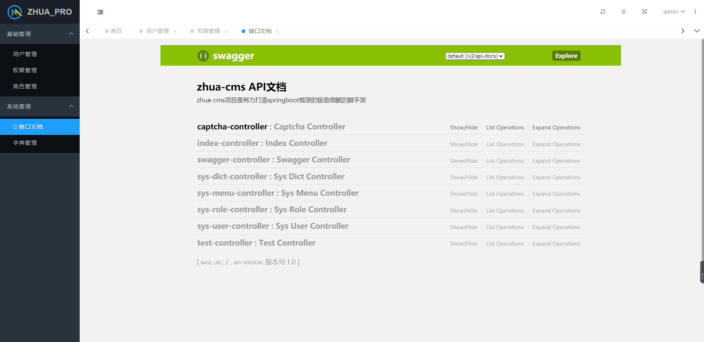

# 欢迎使用 zhua-cms 后台管理系统

> 次项目随缘维护（看心情），有bug请自行维护

**zhua-cms 是基于spring boot + layuimini 开发的后台管理系统**

# 项目介绍

zhua-cms 是基于spring boot + layuimini 开发的后台管理系统，具有完善的权限管理功能，使用shiro进行权限控制，细化到按钮权限，使用mybatis plus数据库插件，实现高效快速开发，前端使用layuinimi，最简洁、清爽、易用的layui后台框架模板。
包含了用户管理，权限管理，角色管理，权限分配，数据权限分配，字典管理，代码生成等功能 相比其他开源的后台开发平台脚手架，zhua-cms 使用简单，可以轻易完成中型，大型系统开发。

# 主要特性

- 界面足够简洁清爽，响应式且适配手机端。
- 一个接口几行代码而已直接初始化整个框架，无需复杂操作。
- 页面支持多配色方案，可自行选择喜欢的配色。
- 支持多tab，可以打开多窗口。
- 支持无限级菜单和对font-awesome图标库的完美支持。
- 失效以及报错菜单无法直接打开，并给出弹出层提示完美的线上用户体验。
- url地址hash定位，可以清楚看到当前tab的地址信息。
- 刷新页面会保留当前的窗口，并且会定位当前窗口对应左侧菜单栏。
- 支持font-awesome图标选择插件

## 工作流部分说明

工作流程模块角色权限未设置

系统默认user1-员工组、user2-总监组、user3-经理组、user4-人力资源组 四个用户，在activiti自己表中也相应有各个用户，具体查看`ACT_ID_USER`表

流程新建完成便立即提交至下一节点审批

流程模型分类：
- 方式一：单向流程，流程不会指向上级节点，用户任务未设置代理人，可参考`多节点单向流程`模型
- 方式一：环形流程，流程会指向上级节点形成环形，用户任务设置代理人，网关配置跳转条件，可参考`请假流程模型`模型

方式一新建的流程，在流程提交、审批时需要指定任务的审批人以及审批节点，方式二无需设置

流程审批跳转条件默认：`${outcome=='同意'}`、`${outcome=='驳回'}`

流程审批支持 撤回、通过、驳回、驳回首环节、驳回上环节、驳回任意环节

驳回操作主要针对方式二模型流程进行驳回操作

# 运行项目

springboot 方式运行

## 基础环境
- jdk8+
- maven

# 运行截图

